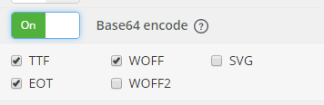

## 前言

一下注意点是基于小程序基础库版本1.2.2（2017.05.26更新）提出的

## 微信小程序使用注意点

1. 在小程序中`texarea`的自动聚焦存`auto-focus`和焦距`focus`属性在真机中存在不能正常焦距的问题。
2. 小程序中的表单重置组件即`<button form-type="reset"></button>`在真机中重置以后有可能会出现不能重新聚焦的问题。
3. 图片文件夹需要放在与pages同级的目录，引用图片的时候链接需要这样:需要在路径前面加上`/`指向根目录
4. 在使用`wx.request`发送请求的时候请求地址记得先在[微信公众平台](https://mp.weixin.qq.com/)的设置那里设置合法请求地址（必须是以https开头，还不能以locallhost、ip地址作为域名，还不能有端口号）

## 在微信小程序中使用阿里图标库

因为在wxss中的@font-face不能接受http地址为参数，但是能接受base64地址，所以下面将介绍如何使用外部字体库（以阿里图标库为例）

1. 将阿里图标库下载至本地
2. 点击add fonts将下载的iconfont.ttf文件上传，**注意**将Base encode选项打开，下面的勾根据需要选上。如图
3. 点击convert按钮将转换后的文件下下来
4. 将下下来的压缩包解压出来，将字体文件复制会使用到字体库对应页面的文件下，或者复制到与app.wxss同级的目录下。
5. 将压缩包解压出来的stylesheet.css文件内容复制到对应wxss文件里。
6. （阿里字体库多做这一步）将iconfont.css文件里的对应字体图标声明复制（也就是从类iconfont声明结束以后开始复制）到对应wxss文件里